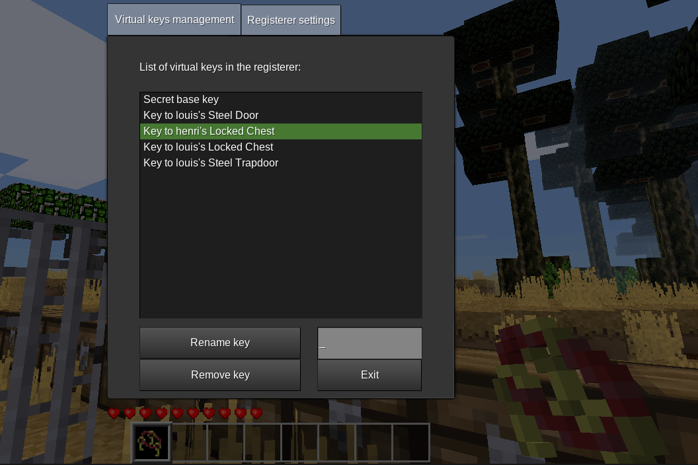

# Virtual key

  

This minetest mod add virtual keys you can add in your keyring.

Craft a virtual keys registerer and start using it as regular skeleton-keys.
Content of registerer can be copied without loss on any other registerer and added on any keyring.

## Craft
### Virtual keys registerer (shapeless)
- `keys:skeleton_key`
- `basic_materials:ic`

### Personal virtual keys registerer (shapeless)
- `keys:skeleton_key`
- `basic_materials:ic`
- `basic_materials:padlock`

or
- `virtual_key:virtual_key_registerer`
- `basic_materials:padlock`

### Synchronize virtual keys (shapeless)
- `group:virtual_key`
- `virtual_key:virtual_key_registerer`

or
- `group:virtual_key`
- `virtual_key:personal_virtual_key_registerer`

Notes:
- if you use a personal virtual keys registerer in the craft, then it must belong to you, else the craft will be forbidden.
- you cannot register a virtual key using a key/keyring in a craft: you need to click on the locked node to register the virtual key, then if you borrow a regular key to another player, no clandestine copy can be done.
- since it is a synchronization, all registerer will contains the same virtual keys
- if the same virtual key is registered in both registerer with a different name, one of the name will be overwritten

## How to use your registered virtual keys
Once you have registered virtual keys, you need to copy them to a keyring. You can use the following craft provided by `keyring` mod:
- `group:virtual_key`
- `keyring:keyring`

or
- `group:virtual_key`
- `keyring:personal_keyring`

Notes:
- if you use a personal virtual keys registerer or a personal keyring in the craft, then it must belong to you, else the craft will be forbidden.
- since it is a copy from the register to the keyring, you will get your registerer back will all its virtual keys

## Dependencies
- [basic_materials](https://github.com/mt-mods/basic_materials)
- [keyring](https://github.com/louisroyer-minetest/keyring)
- keys (from MTG)

## License
- CC0-1.0, Louis Royer 2020-2022

## Settings
Setting `virtual_key.personnal_vkeys_registerer` is available to disable/enable personal virtual keys registerer (enabled by default).
